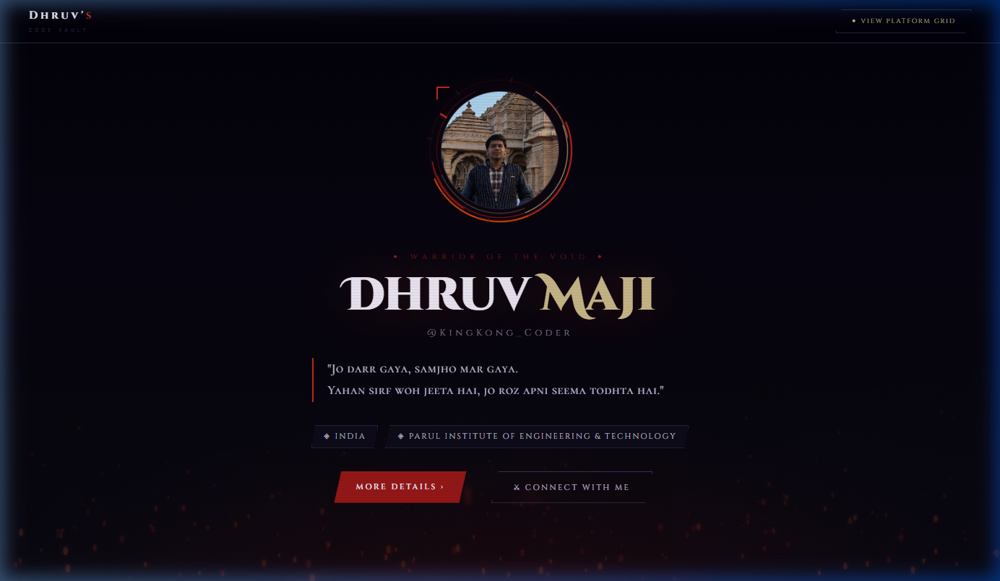
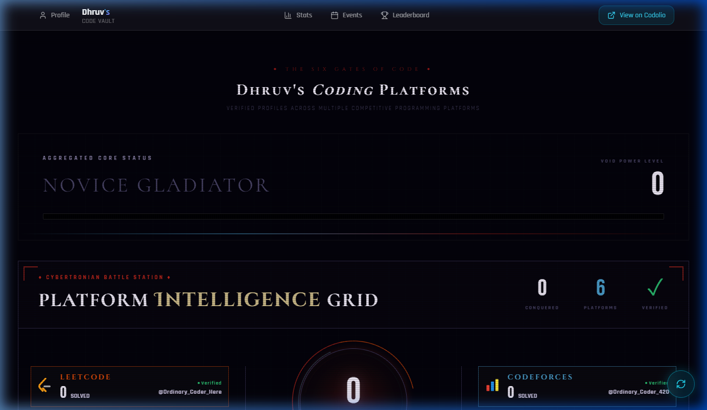
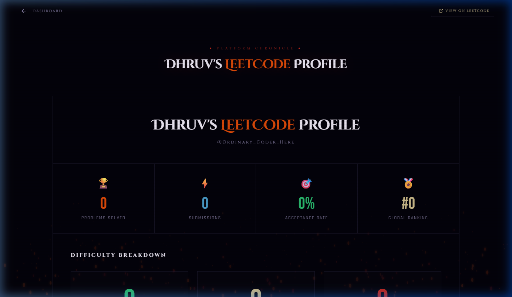
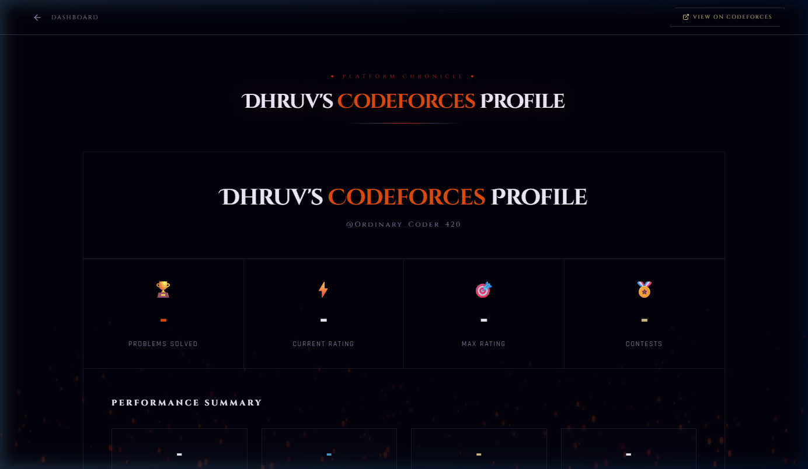

<div align="center">
  

  <h1 align="center">Developer Coding Record Book</h1>

  <p align="center">
    <em>"Track Stats. Break Limits. Increase Your Power Level."</em>
    <br /><br />
    A cinematic, full-stack dashboard that aggregates and visualizes competitive programming stats across multiple platforms in real time. Designed with a futuristic HUD-inspired interface, it transforms raw coding data into an immersive experience—helping developers track progress, monitor contests, and push their limits with a unified "power level" system.
    <br /><br />
    <a href="https://github.com/Dhruv4848l/Developer-Coding-Record-Book"><strong>Explore the docs »</strong></a>
    <br />
    <br />
    <a href="https://github.com/Dhruv4848l/Developer-Coding-Record-Book/issues">Report Bug</a>
    ·
    <a href="https://github.com/Dhruv4848l/Developer-Coding-Record-Book/issues">Request Feature</a>
  </p>

  <div>
    
    
    
    
  </div>
</div>

---

<div align="center">

<br/><br/>

### The Cover — Warrior of the Void


<br/><br/>

### The Dashboard — Platform Intelligence Grid


<br/><br/>

### LeetCode Chronicle — Platform Deep Dive


<br/><br/>

### Codeforces Chronicle — Performance Summary


</div>

---

## 🚀 About The Project

**Developer Coding Record Book** (formerly Personal Coding Tracker) is a full-stack MERN application with a dark, fiery UI inspired by sci-fi HUDs. It scrapes and aggregates your competitive programming stats across **6 major platforms** in real-time, giving you a centralized view of your coding journey.

This project goes beyond a simple stat tracker—it’s a **cinematic dashboard** featuring fiery canvas animations, glassmorphism panels, orbital avatar rings, and micro-animations designed to motivate and push your limits.

> *"Jo darr gaya, samjho mar gaya. Yahan sirf woh jeeta hai, jo roz apni seema todhta hai."*

### Why I Built This

Keeping track of progress across multiple coding platforms can be tedious. I wanted a **single, unified command center** to:

- 📊 Monitor live data from LeetCode, Codeforces, CodeChef, GeeksforGeeks, HackerRank, and AtCoder.
- 🎯 Track upcoming contests across all platforms effortlessly.
- 📈 Visualize my growth with rank-synchronized visualizations and rating graphs.
- ⚡ Have a shareable "Dev Card" with an aggregated "Power Level".

---

## ✨ Features

| Feature | Description |
|---------|-------------|
| **🏆 Multi-Platform Stats** | Live data from LeetCode, Codeforces, CodeChef, GeeksforGeeks, HackerRank, and AtCoder |
| **📊 Platform Dashboards** | Dedicated pages per platform with rank-synchronized visualizations and activity heatmaps |
| **📅 Contest Tracker** | Upcoming contest aggregator across all platforms with direct links |
| **🎮 Cinematic UI** | Fiery canvas animations, glassmorphism panels, orbital rings, and micro-animations |
| **🃏 Dev Card** | Shareable profile card with aggregated stats and custom design |
| **🔄 Sync Terminal** | One-click data refresh with a retro terminal typewriter animation |
| **⚡ Power Level Bar** | Aggregated skill rating visualization across all connected platforms |
| **🎯 GFG 160 Tracker** | Progress tracker specifically for the GeeksforGeeks 160 challenge |
| **📱 Responsive Design** | Fully mobile-optimized with bottom navigation |

---

## 🛠️ Tech Stack

<table>
<tr>
<td><strong>Frontend</strong></td>
<td>React 18, TypeScript, Vite, Tailwind CSS, Framer Motion</td>
</tr>
<tr>
<td><strong>UI Components</strong></td>
<td>Radix UI, shadcn/ui, Recharts, Three.js</td>
</tr>
<tr>
<td><strong>Backend</strong></td>
<td>Node.js, Express 5, TypeScript</td>
</tr>
<tr>
<td><strong>Data Fetching</strong></td>
<td>Custom API scrapers with node-cache, Axios</td>
</tr>
<tr>
<td><strong>State Management</strong></td>
<td>TanStack React Query</td>
</tr>
<tr>
<td><strong>Routing</strong></td>
<td>React Router v6</td>
</tr>
</table>

---

## 🏗️ Architecture

```
Developer-Coding-Record-Book/
├── backend/
│   ├── routes/          # Platform-specific API scrapers
│   │   ├── leetcode.ts, codeforces.ts, codechef.ts, gfg.ts...
│   ├── lib/cache.ts     # Server-side caching layer
│   └── server.ts        # Express server entry point
├── src/
│   ├── components/      # Reusable UI components
│   │   ├── PlatformStats.tsx, ContestTracker.tsx, SyncTerminal.tsx...
│   ├── hooks/           # Custom React hooks for data fetching
│   ├── pages/           # Route-level page components
│   │   ├── CoverPage.tsx, Dashboard.tsx, platforms/...
│   └── data/            # Static data (GFG 160 problems list)
├── public/              # Static assets (favicon, profile image)
├── index.html           # App entry point
├── vite.config.ts       # Vite configuration
└── tailwind.config.ts   # Tailwind CSS theme config
```

---

## 🚀 Getting Started

### Prerequisites

- **Node.js** v18 or higher
- **npm** or **yarn**

### 1. Clone the Repository

```bash
git clone https://github.com/Dhruv4848l/Developer-Coding-Record-Book.git
cd Developer-Coding-Record-Book
```

### 2. Backend Setup

```bash
cd backend
npm install
```
Create a `backend/.env` file:
```env
PORT=5000
```
Start the backend server:
```bash
npm run dev
```

### 3. Frontend Setup

In the project root, install dependencies:
```bash
npm install
```
Create a `.env.local` file in the root:
```env
VITE_BACKEND_URL=http://localhost:5000
```
Start the frontend dev server:
```bash
npm run dev
```

### 4. Run Both Together

From the project root:
```bash
npm start
```
*This uses `concurrently` to launch both frontend and backend simultaneously.*

---

## 🎨 Design Philosophy

The UI follows a **"Cybertronian Forge"** aesthetic:
- Dark backgrounds with deep purples and crimson accents.
- Animated fire canvas as the ambient background.
- Floating panels with subtle transparency — no heavy glassmorphism blocking the backdrop.
- Terminal-style sync interface with typewriter effects.

---

## 👤 Author

<table>
<tr>
<td align="center">
<a href="https://github.com/Dhruv4848l">
<br />
<sub><b>Dhruv Maji</b></sub>
</a><br />
<a href="https://www.linkedin.com/in/mr-dhruv-maji/" title="LinkedIn">🌐 LinkedIn</a>
<br/>
<a href="https://x.com/DhruvMaji" title="Twitter">🐦 Twitter</a>
</td>
</tr>
</table>

---

## 🤝 Contributing

We welcome contributions! If you'd like to improve the project:

1. Fork the repository
2. Create a feature branch (`git checkout -b feature/amazing-feature`)
3. Commit your changes (`git commit -m 'Add amazing feature'`)
4. Push to the branch (`git push origin feature/amazing-feature`)
5. Open a Pull Request

---

## 📜 License

This project is for personal use. All rights reserved.

---

<div align="center">

> *"Har contest ek yudh hai. Har problem ek dushman. Main tab tak nahi rukta — jab tak jeet nahi jaata."*

<br/>

⭐️ If you like this project, give it a star! ⭐️

</div>
